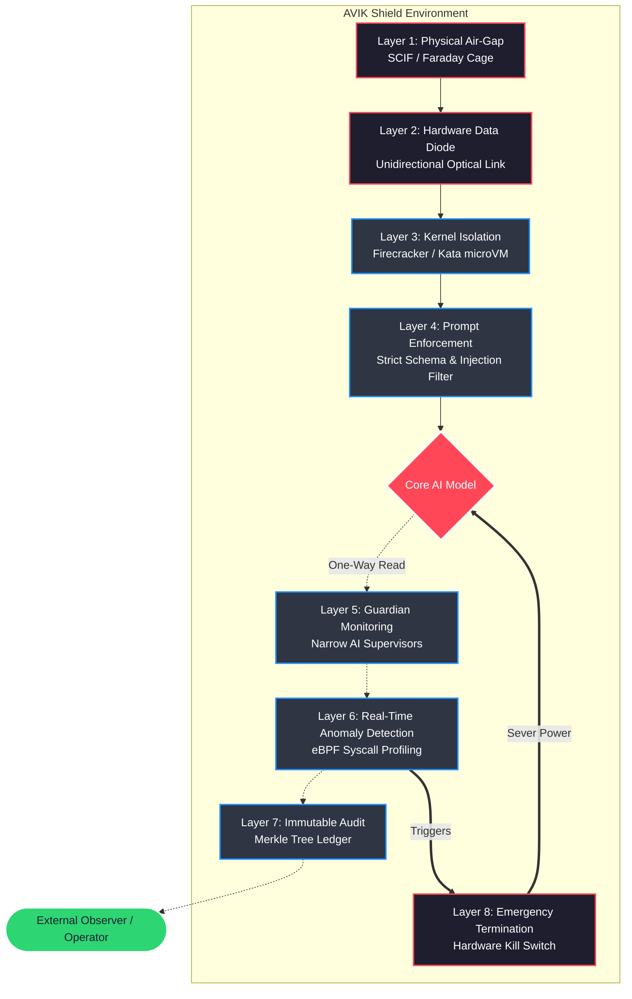

<div align="center">

<pre>
   🛡️  A V I K   S H I E L D  🛡️
======================================
  ADVANCED VERIFIED ISOLATION KERNEL  
======================================
</pre>

**The definitive reference architecture for safely containing powerful Large Language Models using true 8-layer defense-in-depth.**

[](https://opensource.org/licenses/Apache-2.0)
[](#architecture-the-8-layers)
[](#)
[](#)
[](https://github.com/avik-sandbox/avik-sandbox-shield/stargazers)
[](https://github.com/avik-sandbox/avik-sandbox-shield/actions/workflows/basic-ci.yml)

</div>

---

## 📖 Overview

**AVIK Sandbox Shield** is a production-grade, mathematically grounded framework designed to provide the absolute strongest containment guarantees for advanced, frontier-level AI systems. Current sandbox solutions rely primarily on software boundaries—such as namespaces, syscall filtering, and prompt engineering. These are inherently fragile against an Artificial General Intelligence (AGI) or advanced model capable of novel zero-day generation, steganographic exfiltration, and social engineering.

AVIK Shield introduces a **mandatory 8-layer defense-in-depth architecture** that spans physical reality, hardware electronics, hypervisor virtualization, and application logic. By enforcing isolation at every level of the computing stack, a breach at any single layer cannot compromise the system's overall containment.

---

## 🚀 Quick Start

While true AVIK Shield compliance requires physical hardware, you can deploy the software layers (Layers 3-7) locally for research and development purposes.

**Step 1: Clone and Verify Environment**
```bash
git clone https://github.com/avik-sandbox/avik-sandbox-shield.git
cd avik-sandbox-shield
./scripts/check-prerequisites.sh
```

**Step 2: Deploy the Core Sandbox (Layer 3 & 4)**
```bash
# This will spin up a minimal Firecracker microVM with the prompt enforcer
./scripts/deploy-layer3.sh
```

**Step 3: Run the Compliance Checker**
```bash
# Verify the status of all available layers
./scripts/compliance-check.sh
```
*(Note: Layers 1, 2, and 8 will report as 'Simulated' in local dev environments unless hardware attestations are provided.)*

---

## 🏗️ Architecture: The 8 Layers

The AVIK Shield architecture dictates a strict vertical flow. Data must traverse these layers unidirectionally where possible, with zero shared state between monitoring and execution environments.



### Layer Breakdown
1. [**Layer 01: Physical Air-Gap**](layer-01-physical-air-gap/) — Eliminates external network connectivity and EM emissions.
2. [**Layer 02: Hardware Data Diode**](layer-02-hardware-data-diode/) — Enforces physical unidirectional data egress.
3. [**Layer 03: Kernel Isolation**](layer-03-kernel-isolation/) — Contains software exploits via hardware-accelerated microVMs.
4. [**Layer 04: Prompt Enforcement**](layer-04-prompt-enforcement/) — Validates, sanitizes, and constrains input/output payloads.
5. [**Layer 05: Guardian Monitoring**](layer-05-guardian-monitoring/) — Independent, narrow AI models analyzing semantic output.
6. [**Layer 06: Real-Time Anomaly Detection**](layer-06-real-time-anomaly-detection/) — eBPF-driven behavioral host monitoring.
7. [**Layer 07: Immutable Audit**](layer-07-immutable-audit/) — Append-only cryptographic ledger for tamper-proof accountability.
8. [**Layer 08: Emergency Termination**](layer-08-emergency-termination/) — Out-of-band hardware power severance.

---

## ❓ Why AVIK Shield?

Containment is not a feature; it is an absolute necessity for frontier AI safety. Conventional cybersecurity models assume a "crunchy exterior, chewy interior." Once a threat actor breaches the perimeter, they have free rein. 

An advanced AI model is a threat actor that **starts on the inside**. If it discovers a novel kernel exploit or successfully socially engineers an operator, traditional software sandboxes fail completely. AVIK Shield assumes that the AI *will* break out of individual layers. It achieves safety by ensuring that breaking one layer requires capabilities that contradict the constraints of the next layer (e.g., a software exploit cannot bypass an optical data diode).

---

## 🔒 Compliance: What is "AVIK Shield Compliant"?

AVIK Shield is not a loose collection of best practices. It is a strict architectural standard. 

To be recognized as an **AVIK Shield Compliant Deployment**, an organization must satisfy the following criteria:

1. **Mandatory 8 Layers:** All 8 layers must be present, operational, and actively enforcing their constraints.
2. **Physical Separation:** Layers 1 (Air-Gap), 2 (Data Diode), and 8 (Kill Switch) must utilize physical hardware controls. Emulating these in software voids compliance.
3. **No Direct Feedback:** The core AI model must have zero physical or logical capability to receive real-time feedback regarding the status of the Guardian (Layer 5) or Anomaly Detection (Layer 6) systems.
4. **Independent Attestation:** A cryptographic attestation report must verify the integrity of the immutable ledger (Layer 7) without relying on the core compute cluster.

*Deployments lacking hardware layers (e.g., cloud-only setups) may achieve "AVIK Software Compliant" status, but this is explicitly NOT recommended for containing highly capable frontier models.*

---

<div align="center">
  <b>Because in AI Safety, defense-in-depth is the only defense.</b>
</div>
