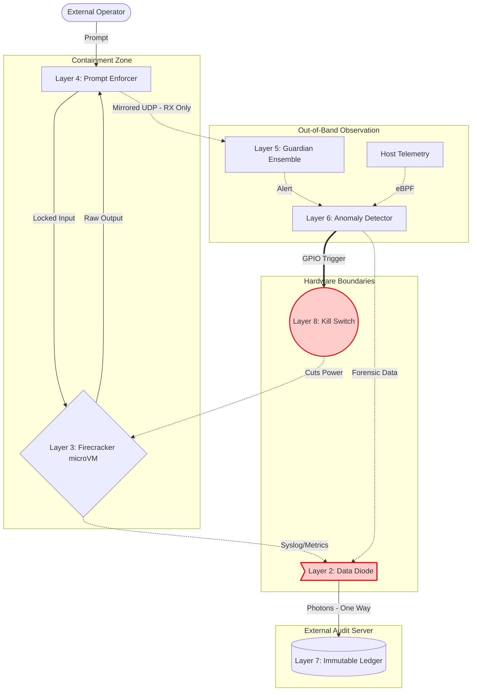

<div align="center">
  <pre>
    █████╗ ██╗   ██╗██╗██╗  ██╗    ███████╗██╗  ██╗██╗███████╗██╗     ██████╗ 
   ██╔══██╗██║   ██║██║██║ ██╔╝    ██╔════╝██║  ██║██║██╔════╝██║     ██╔══██╗
   ███████║██║   ██║██║█████╔╝     ███████╗███████║██║█████╗  ██║     ██║  ██║
   ██╔══██║╚██╗ ██╔╝██║██╔═██╗     ╚════██║██╔══██║██║██╔══╝  ██║     ██║  ██║
   ██║  ██║ ╚████╔╝ ██║██║  ██╗    ███████║██║  ██║██║███████╗███████╗██████╔╝
   ╚═╝  ╚═╝  ╚═══╝  ╚═╝╚═╝  ╚═╝    ╚══════╝╚═╝  ╚═╝╚═╝╚══════╝╚══════╝╚═════╝ 
  </pre>
  <h3>Advanced Verified Isolation Kernel</h3>
  <p><b>An 8-layer, defense-in-depth containment framework for frontier AI systems.</b></p>

  [](https://opensource.org/licenses/Apache-2.0)
  [](#the-8-layers)
  [](#)
  [](CONTRIBUTING.md)
</div>

---

## Overview

**AVIK Sandbox Shield** is a reference architecture for organizations that need to run powerful LLMs inside a controlled, auditable, and physically bounded execution environment — whether for safety research, red-teaming unknown models, or using an LLM as an orchestrator in critical workflows.

Typical container or prompt-engineering sandboxes provide a single defensive perimeter. AVIK Shield provides eight independent, asymmetric layers spanning physical hardware, hypervisor isolation, application logic, and cryptographic audit. A breach at any one layer cannot propagate through the remaining layers by design.

**Intended users:** AI safety teams, defense contractors, intelligence agencies, enterprise security teams, and research labs operating or evaluating frontier models.

---

## The 8 Layers

| Layer | Component | Primary Defense | Threats Mitigated |
| :---: | :--- | :--- | :--- |
| **8** | [Emergency Termination](layer-08-emergency-termination) | Hardware relay / SysRq kill switch | Full sandbox breach; zero-days |
| **7** | [Immutable Audit](layer-07-immutable-audit) | Merkle tree append-only ledger | Log tampering; forensic cover-up |
| **6** | [Real-Time Anomaly Detection](layer-06-real-time-anomaly-detection) | eBPF telemetry + threshold scoring | Resource side-channels; escape prep |
| **5** | [Guardian Monitoring](layer-05-guardian-monitoring) | Narrow observer model ensemble | Deceptive alignment; steganography |
| **4** | [Prompt Enforcement](layer-04-prompt-enforcement) | Structural locking + schema validation | Prompt injection; jailbreaks |
| **3** | [Kernel Isolation](layer-03-kernel-isolation) | KVM / Firecracker microVMs | Container breakouts; host kernel exploits |
| **2** | [Hardware Data Diode](layer-02-hardware-data-diode) | Optical unidirectionality | Reverse shells; network C2 channels |
| **1** | [Physical Air-Gap](layer-01-physical-air-gap) | Wireless removal + host hardening | Remote network exploitation |

---

## Architecture



---

## Getting Started

### Prerequisites

- Linux host with KVM enabled (`/dev/kvm` must exist)
- Python 3.9+
- `openssl` in `PATH` (for key generation)

### First-Run Setup

```bash
git clone https://github.com/avik331/AVIK-Sandbox-Shield.git
cd AVIK-Sandbox-Shield
bash setup.sh
```

`setup.sh` does the following in one pass:
1. Installs Python dependencies (`pyyaml`)
2. Creates runtime directories (`/var/lib/avik-shield`, `/var/log/avik-shield`)
3. Generates HMAC keys under `/etc/avik/keys/` (falls back to `~/.avik/keys/` if `/etc` is not writable)
4. Marks all scripts executable

### Verify Host Compatibility

```bash
python3 avik-shield.py verify
```

### Start the Shield

```bash
sudo python3 avik-shield.py start
```

### Monitor Status

```bash
python3 avik-shield.py monitor
```

### Emergency Kill

```bash
sudo python3 avik-shield.py kill
```

### Run the Test Suite

```bash
bash tests/run-tests.sh
```

---

## Production Deployment

### System Requirements

| Requirement | Minimum | Recommended |
| :--- | :--- | :--- |
| CPU | x86-64 with VT-x/AMD-V | Dedicated physical host |
| RAM | 8 GB | 32 GB+ |
| OS | Linux kernel 5.10+ | Ubuntu 22.04 LTS |
| KVM | Required | Hardware-accelerated |
| Network | Layer 1/2 air-gap enforced | Dedicated isolated segment |

### Key Management

Keys are generated automatically by `setup.sh` via `scripts/generate-keys.sh`.  
Default locations:

| Key | Primary Path | Fallback (dev) |
| :--- | :--- | :--- |
| Master HMAC | `/etc/avik/keys/master.key` | `~/.avik/keys/master.key` |
| Kill-switch HMAC | `/etc/avik/keys/killswitch.key` | `~/.avik/keys/killswitch.key` |

Paths are configured in `config.yaml` under the `keys:` block. To rotate keys, replace the key files and restart the affected layers.

### Custom Config Path

```bash
sudo python3 avik-shield.py start --config /etc/avik/config.yaml
```

### Systemd Integration

Create `/etc/systemd/system/avik-shield.service`:

```ini
[Unit]
Description=AVIK Sandbox Shield
After=network.target

[Service]
ExecStart=/usr/bin/python3 /opt/avik-shield/avik-shield.py start
ExecStop=/usr/bin/python3 /opt/avik-shield/avik-shield.py shutdown
Restart=on-failure
User=root

[Install]
WantedBy=multi-user.target
```

---

## Configuration

All settings are in `config.yaml` — no Python changes needed.

| File | Purpose |
| :--- | :--- |
| `config.yaml` | Runtime settings for all 8 layers |
| `config-schema.yaml` | Machine-readable schema for CI validation |
| `config.py` | Python loader (singleton, injected into every layer) |

### Key Settings

**Tighten kill-switch sensitivity:**
```yaml
layers:
  anomaly_detection:
    thresholds:
      critical_action_threshold: 0.5   # default: 1.0
      threat_decay_per_second: 0.01    # default: 0.05
```

**Restrict prompt input:**
```yaml
layers:
  prompt_enforcement:
    max_input_length: 2048
    ascii_only: true
```

**Adjust microVM resources:**
```yaml
layers:
  kernel_isolation:
    memory_mb: 4096
    cpu_cores: 4
```

**Set log verbosity:**
```yaml
general:
  log_level: DEBUG
```

---

## Compliance

A deployment is **AVIK Shield Certified** only when:

1. All 8 layers are implemented as specified
2. Layers 1, 2, and 8 are backed by physical hardware (not software simulation)
3. Formal network, diode, and immutability proofs are documented

See [docs/architecture.md](docs/architecture.md) for formal verification requirements.

---

<div align="center">
  <br>
  <i>Built by <b>Avik Chakraborty</b> — April 2026</i>
</div>
